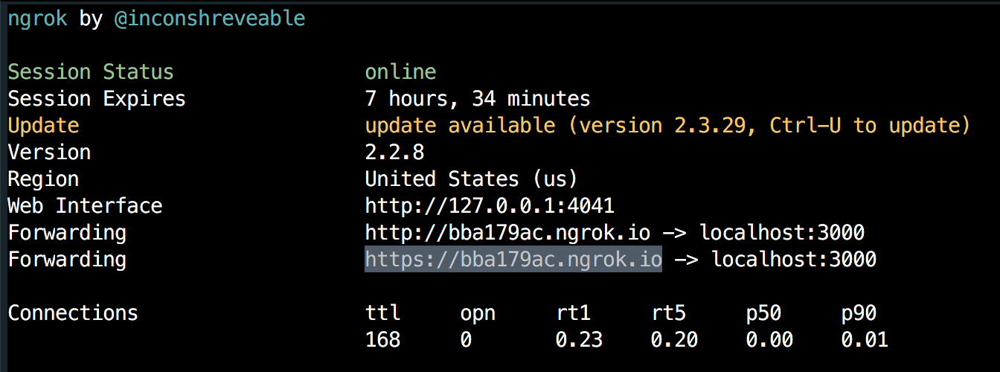
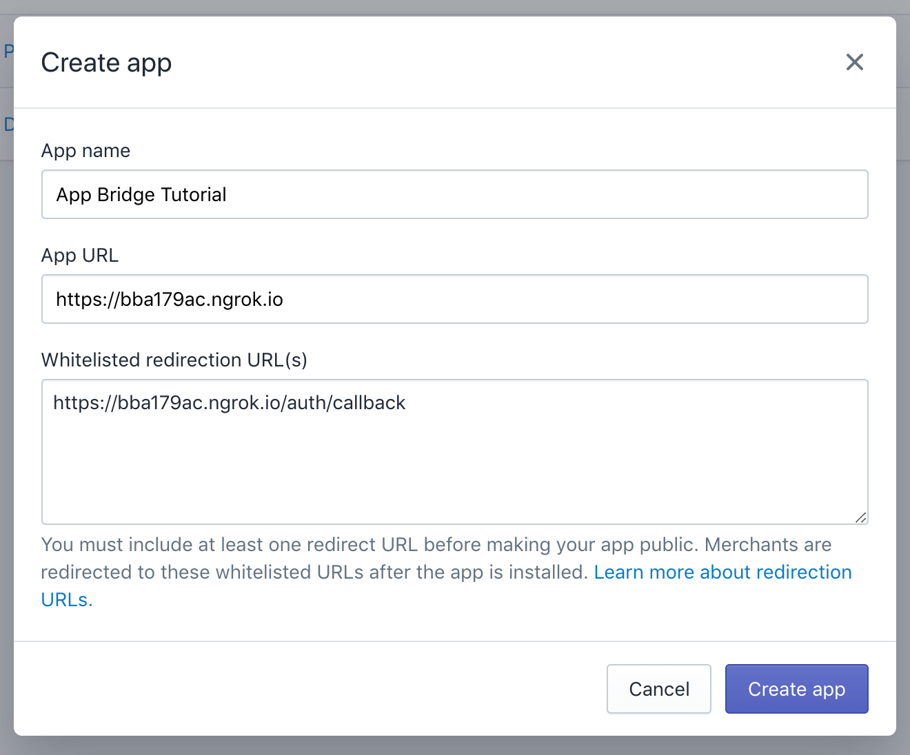
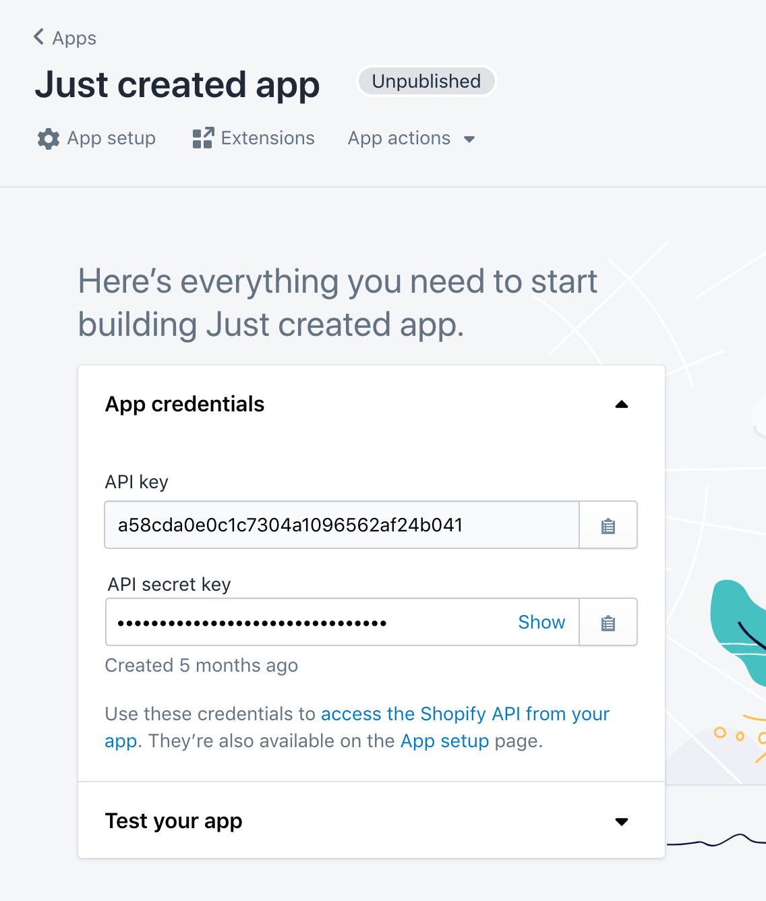
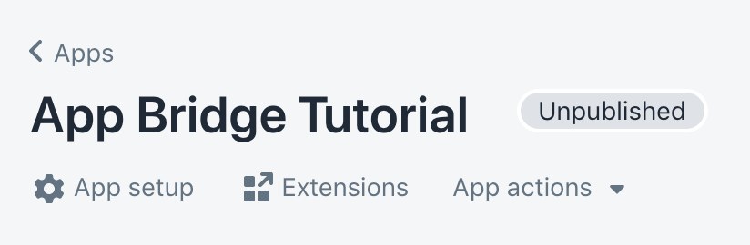
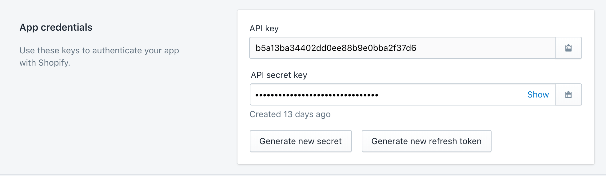
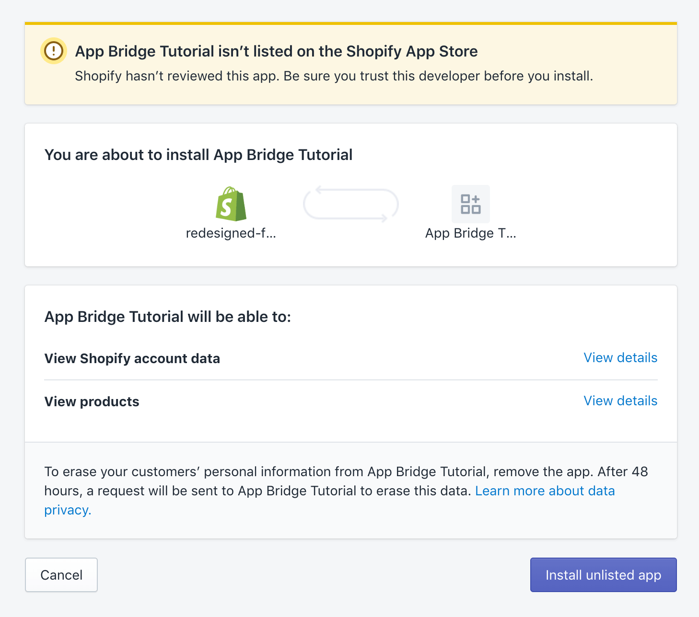
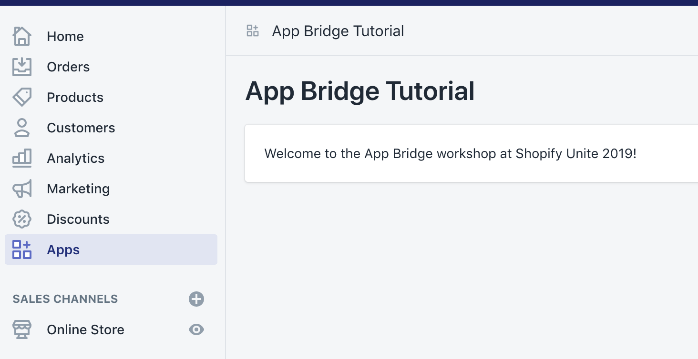

# Pre-workshop setup

Please complete **before** the workshop.

If you’d prefer to work with your own app during the workshop, make sure your app is embedded, installed on a dev shop, and that you have App Bridge installed and running.

### Setup instructions

1.  Ensure you have [Node.js](https://nodejs.org/en/download/) installed. Check your Node version by running:

    ```
    node -v
    ```

    If Node is already installed, make sure that it’s version 8.1.0 or later.

2.  Clone the `app-bridge-tutorial` repository:

    ```
    git clone git@github.com:Shopify/app-bridge-tutorial.git
    ```

3.  Navigate into the `app-bridge-tutorial` folder and install dependencies using `npm`.

    ```
    npm install
    ```

4.  Install [ngrok](https://ngrok.com). Using npm:

    ```
    npm install -g ngrok
    ```
    
    You can also install ngrok by [downloading a binary](https://ngrok.com/download).

    > Note: some Mac users may experience a permissions error installing ngrok using npm, because their global `node_modules` folder may not have correct permissions.
    >
    > Locate the path to the global `node_modules` folder by running:
    >
    > ```
    > npm root -g
    > ```
    >
    > Change the owner of the global `node_modules` folder to the current user:
    >
    > ```
    > sudo chown -R $(whoami) PATH TO GLOBAL NODE_MODULES FOLDER
    > ```
    >
    > You may be asked for your login password after running this command.

5.  Run ngrok to create a tunnel from local port 3000 to a publicly accessible URL:

    ```shell
    ngrok http 3000
    ```

6.  Copy the HTTPS forwarding URL from ngrok:

    

7.  In the Shopify Partners Dashboard, [create a new public app](https://help.shopify.com/en/api/getting-started/authentication/public-authentication#generate-credentials-from-your-partner-dashboard).

    Paste the URL from ngrok into the 'App URL' field.

    Paste the same URL into the Whitelisted Redirection URL(s) field, and add `/auth/callback`.

    

8. If you just created your app, you should see your app’s API key and secret now.

	

	If the app already has an install, you can find this information at the bottom of the 'App Setup' page.
	
	
	
	
	
	Copy the API key and secret.

9. In the `app-bridge-tutorial` folder, copy the `env` file to `.env`, and paste the API key and secret into the `.env` file.

10. Run the app:

    ```
    npm run dev
    ```

11. If you don’t already have a development store, [create one now](https://help.shopify.com/en/partners/dashboard/development-stores#create-a-development-store).

12. To install your app on your development store, add the HTTPS version of your ngrok forwarding URL and your development store’s URL to the following placeholder and load it in a browser:

    `https://YOURNGROKADDRESS.io/auth?shop=YOURSHOPIFYSTORE.myshopify.com`, ie: `https://12345.ngrok.io/auth?shop=best-dev-store.myshopify.com`.

    You should see the unlisted app install screen. Click 'Install unlisted app':

    

    The app should now load and redirect to Shopify Admin. You should land on the app, embedded:

    

    
13. Just one more thing: install the [Redux DevTools Extension](https://github.com/zalmoxisus/redux-devtools-extension) in Firefox or Chrome.
