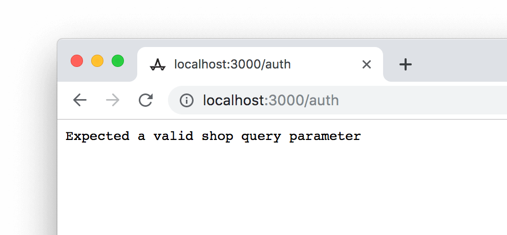
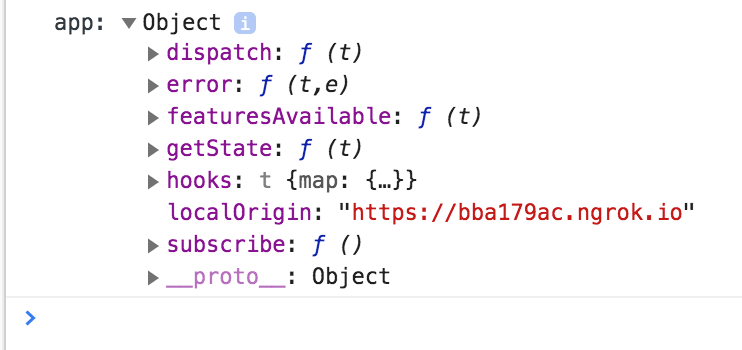

# Pre-workshop setup

Please complete **before** the workshop.

If you’d prefer to work with your own app during the workshop, make sure your app is embedded, installed on a dev shop, and that you have App Bridge installed and running.

### Setup instructions

1.  Ensure you have [Node.js](https://nodejs.org/en/download/) installed. You can check by running:

    ```shell
    node -v
    ```

    If it’s already installed, make sure that you’re using version 8.1.0 or later.

2.  Clone the `app-bridge-tutorial` repository:

    ```shell
    git clone git@github.com:Shopify/app-bridge-tutorial.git
    ```

3.  Navigate into the `app-bridge-tutorial` folder and install dependencies using `npm`.

    ```shell
    npm install
    ```

4.  Run the app locally. Visit <a href="http://localhost:3000">http://localhost:3000</a> to see the app. The app is not expecting to run like this, so you’ll see an error message:

    ```
    npm run dev
    ```

    

5.  Install [ngrok](https://ngrok.com). Using npm:

    ```shell
    npm install -g ngrok
    ```

	> Note: some Mac users may experience a permissions error when running this command, because their global `node_modules` folder may not have correct permissions.
	> Locate the path to the global `node_modules` folder by running:
	>
	> 	```
	> 	npm root -g
	> 	```
	> 	
	> 	Change the owner of the global `node_modules` folder to the current user:
	> 	
	> 	```
	> 	sudo chown -R $(whoami) PATH TO GLOBAL NODE_MODULES FOLDER
	> 	```
	> 	
	> 	You may be asked for your login password.

6.  Run ngrok to create a tunnel from local port 3000 to a publicly accessible URL:

    ```shell
    ngrok http 3000
    ```

7.  Copy the HTTPS forwarding URL from ngrok:

    

8.  In the Shopify Partners Dashboard, create a new app.

    Paste the URL from ngrok into the 'App URL' field.

    Paste the same URL into the Whitelisted Redirection URL(s) field, and add `/auth/callback`.

    

9.  In the `app-bridge-tutorial` folder, copy the `env` file to `.env`. Paste the API key and secret from Partners Dashboard into the `.env` file.

10. Stop the app server by pressing `ctrl` + `c`. Start it again:

    ```
    npm run dev
    ```

11. Add the HTTPS version of your ngrok forwarding URL and your store’s URL to the following placeholder and load it in a browser:

    `https://YOURNGROKADDRESS.io/auth?shop=YOURSHOPIFYSTORE.myshopify.com`, ie: `https://12345.ngrok.io/auth?shop=best-dev-store.myshopify.com`.

    You should see the unlisted app install screen. Click 'Install unlisted app':

    

    The app should now load and redirect to Shopify Admin. You should land on the app, embedded:

    

    If you open the console, you should see the App Bridge instance being logged:

    

    You’re ready to go!
